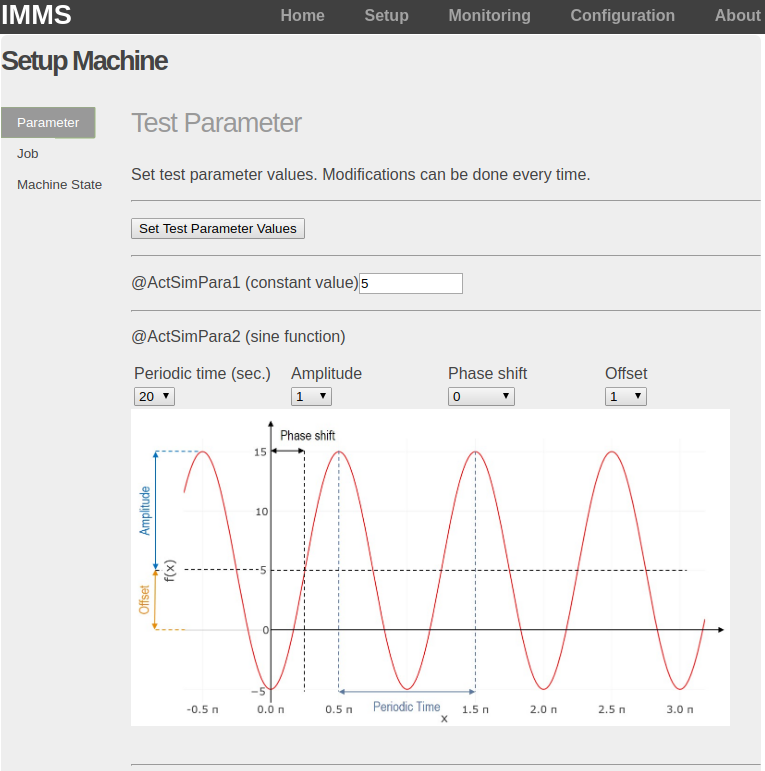
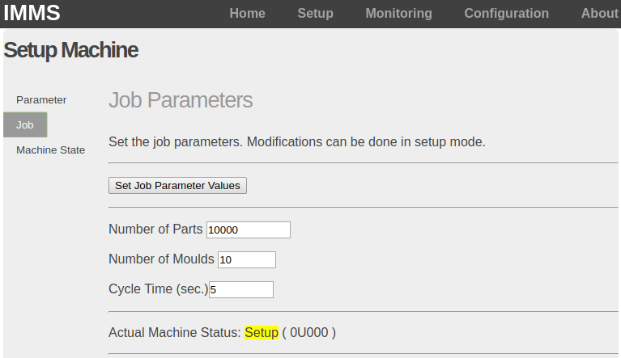
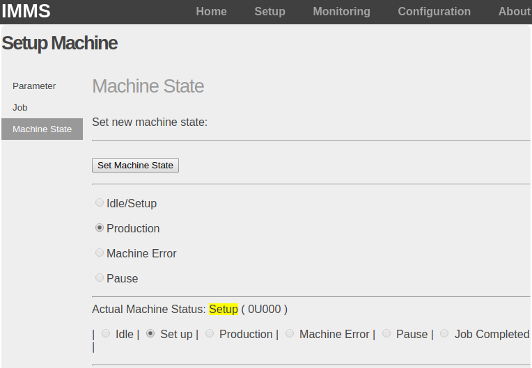
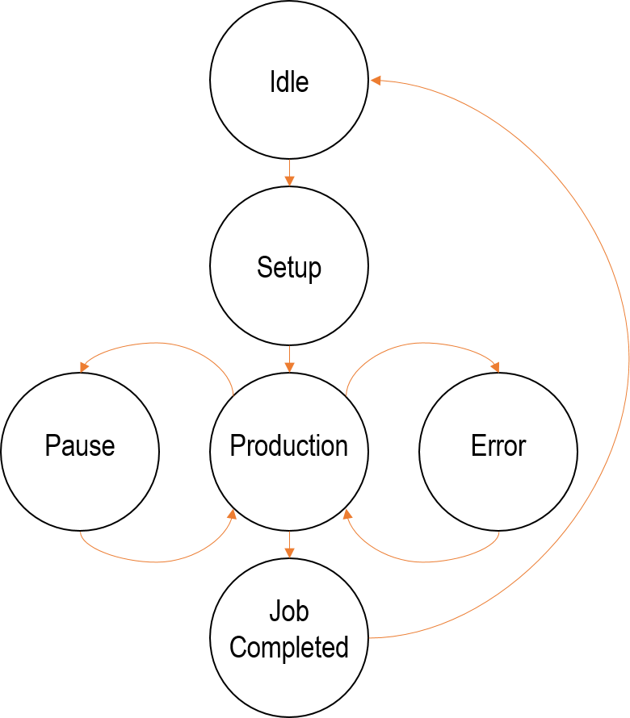
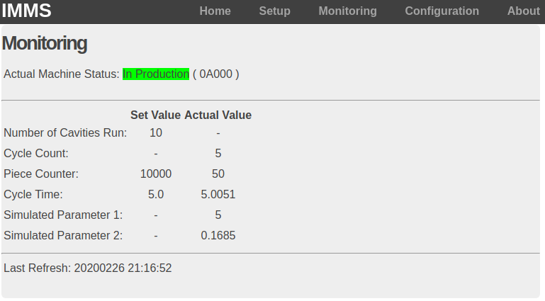
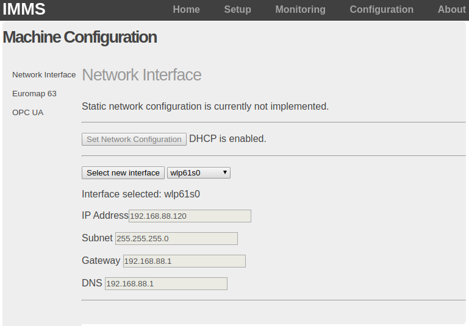
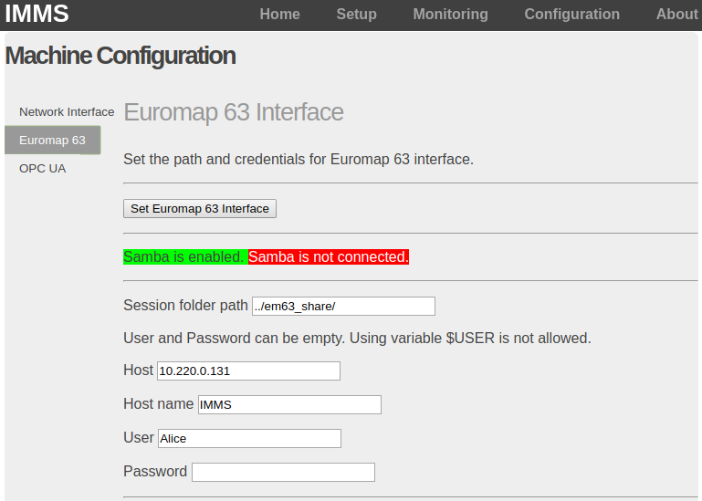

# Injection Molding Machine Simulator (IMMS)

## Introduction
The Injection Molding Machine Simulator (IMMS) simulates an injection molding machine. 
Production jobs can be defined and started in the web-based gui, and process data is simulated.
The IMMS provides the simulated data via well-defined interfaces. 

The parameter names are based on the standard Euromap 63. 
Two communication interfaces are supported: 
1. File-based data exchange and 
2. OPC UA-based data exchange.

For file-based data exchange, the IMMS uses the so called *session folder*.
The IMMS can access the session folder 
1. via Samba protocol or
2. on a local directory.
Samba can be disabled: `--disableSamba`, see *Application of IMMS_APP* for details.

The script *IMMS_APP.py* can be used in different ways:
1. Run as a Docker container, see Dockerfile, 
2. run as a Python script on any machine,
3. run as a Python script on physical IMMS model, that is based on:
- Raspberry Pi 3B+
- 5 inch touchscreen
- RGB LED based on NeoPixel ring.
Hardware support for (3) physical IMMS model can be enabled: `--enablePi3`, see *Run IMMS_APP as physical IMMS model* for details.

The implementation of a playback mode is planed, but it is currently not supported, see *Playback* for details. 


# Application of IMMS_APP

```
## Get help
```sh
$~ python3 IMMS_APP.py --help
```

## Start IMMS
Start the application. 
The production process can be started via web interface, see manual start of simulation.
```sh
$~ python3 IMMS_APP.py
```

## Autostart
Start the application in autostart with default values for process parameters. 
In autostart, the IMMS starts the machine simulation directly in production mode. 
```sh
$~ python3 IMMS_APP.py --autostart
```

## Manual start of the simulation
Open the web site: http://127.0.0.1:5000 and use the visualization in web GUI. 

Select **Setup**
1. Select **Parameter**
  &rarr; and define 2 configurable test parameters (optional)
  &rarr; press the button "Set Test Parameter Values"
  
  
  
2. Select **Job** 
  &rarr; and define your job (number of parts, parts per cycle, cycle time)
  &rarr; press the button "Set Job Parameter Values"
  
  
  
3. Select **Machine State** 
  &rarr; and select Production
  &rarr; and press the button "Set Machine State".
  
  
  
  While machine state is *production*, you can switch to *pause* and *error*.
  When job is finished switch from machine state *job completed* back to *idle*. 
  
  
  
4. Select **Monitoring** and monitor the production simulation.




## Check network configuration
Select Configuration &rarr; and select Network to check the network configuration.




## Use Euromap 63 interface
In simulation mode (default) the following parameters are supported:
```
DATE Actual date
TIME Actual time
ATActSimPara1 configurable test parameter (scalar)
ATActSimPara2 configurable sinoid
ActCntCyc actual cycle counter
ActCntPrt actual part counter 
ActStsMach actual machine status
ActTimCyc actual cycle time
SetCntMld set value for parts per cycle
SetCntPrt set value for parts needed
SetTimCyc set value for cycle time
```
These parameters are described in detail in *GETID.dat*.
You can reqest these parameters using the REPORT command in a job file, see the examples in  *../em63_test*.
In playback mode, only the recorded and stored parameters are available.

### Samba 
Default: Samba connection is enabled. 
Default: "ip".
With `--disableSamba` you can disable the connection try to a samba server. 
The samba server address can be set via env variables if docker is used. 
If docker is not used, the default option for the samba server address is used. 
You can change the samba server address in the web gui: 

Select **Configuration**
1. Select **Euromap 63**
2. Change the samba server address
3. Press the button 




### Local directory
Default: *../em63_share*.
If Samba is disabled, the local directory is used. 
You can change it in the same way like the samba server address. 


### Test Euromap 63 interface
In the directory *../em63_test* you can find test files. 
Each session file refer to a job file that is executed by the IMMS. 
Read the Euromap 63 standard for more information. 


## OPC UA Support
Note: Euromap 63 is based on file-based data exchange, but the OPC UA uses the same parameter names. 
With `--enableOPCUA` you can enable an integrated OPC UA server. 
The two environment variables  `OPCUA_HOST` and `OPCUA_PORT` can be set accordingly, if it is enabled.
Default values are `OPCUA_HOST="localhost"` and `OPCUA_PORT="4840"`.

The following variables are created within the ``IMMS`` object on the server and get updated periodically:
```
DATE <Double>
TIME <String>
ATActSimPara1 <Double>
ATActSimPara2 <Double>
ActCntCyc <Double>
ActCntPrt <Double>
ActStsMach <String>
ActTimCyc <Double>
SetCntMld <Double>
SetCntPrt <Double>
SetTimCyc <Double>
```
This data is equal to the data provided file-based.
Data on the OPC UA server can be easily browsed and visualized using ``opcua-client`` or UaExpert from Unified Automation. 


# Packages
Particular packages are useful; check which is needed.
```sh
$~ apt install python3-lxml python-lxml libxml2-dev libxslt-dev python-dev
$~ apt-install smbclient
```
# Modules needed
Before installing new packages via pip
```sh
pip3 install --upgrade pip
```
Install new packages via pip
```sh
$~ pip3 install python-statemachine --user
$~ pip3 install Flask --user
$~ pip3 install opcua 
$~ pip3 install opcua-client
$~ pip3 install pysmb
$~ pip3 install netifaces
```
Numby and Plotly are not longer needed, but you can install it
```sh
$~ pip3 install numpy --user
$~ pip3 install plotly --user
```


# Run IMMS_APP as physical IMMS model
## Configuration of IMMS_APP as physical IMMS model
With `--enablePi3` you can enable the support for the physical IMMS model. 
The configuration is based on 
* Raspberry Pi 3B+, 
* 5 inch touchscreen, 
* RGB LED based on NeoPixelRing12. 

### Configuration of NeoPixelRing12
Support for the physical IMMS model is needed: `--enablePi3`. 
The number of NeoPixels is 12. 
The libraries *board* and *neopixel* are needed. 

Pin/GPIO configuration:
* PWR to 5V Pin, 
* GND to GND Pin, 
* IN to GPIO21.

### Configuration of 5 inch touchscreen
Support for the physical IMMS model is needed: `--enablePi3`. 
With `--enable5inchTouch` you can enable the support for the 5 inch touchscreen. 
This option is planed but it is currently not implemented. 
ToDo: the style sheet (css file) used for the website can be changed by enabling this option. 

## Start IMMS_APP for physical IMMS model via script 
You can start the IMMS_APP for the physical IMMS model with a script: StartIMMS. 
* It starts a script that starts the IMMS_APP. 
* It waits a while (it can use futher scripts to show LED demos while waiting).
* It starts a script that starts the chromium webbrowser in kiosk mode that displays the web-based gui.
The scripts can be modified so that IMMS can be run with particular enabled and disabled options. 

# Playback mode
The implementation of a playback mode is planed, but it is currently not supported. 
The playback mode can be enabled with `--playback`. 
The data in playback mode is not simulated; but it is based on previously recoreded and stored data. 
Data stored in *../em63_playback/em63_playback.dat* is used. 
It is replied in dependence of the time of the timestamp (parameter TIME in Euromap 63 data).
Furthermore, particular options are disabled that are not needed in this mode. 
In playback mode, the GETID and GETINFO data is not equal to the standard version. 
The GETID and GETINFO data is used that is stored in:
* ../em63_playback/em63_playback_getid.dat
* and ../em63_playback/em63_playback_getinfo.dat. 


# TODO

## Playback
see *Playback mode*.

## Configurable support for 5 inch touchscreen
see *Configuration of 5 inch touchscreen* in *Run IMMS_APP as physical IMMS model*.

## EM63 log file
State: File with correct name is created.
Issue: COMMAND 1 is written to LOG file, COMMAND 2 can not be written. 
Log file is written before COMMAND2 is read.
Reason: RESPONSE is named in JOB file before REPORT, GETID, GETINFO.

## Misc
Reduce global variables and use call by reference instead of global variables.
